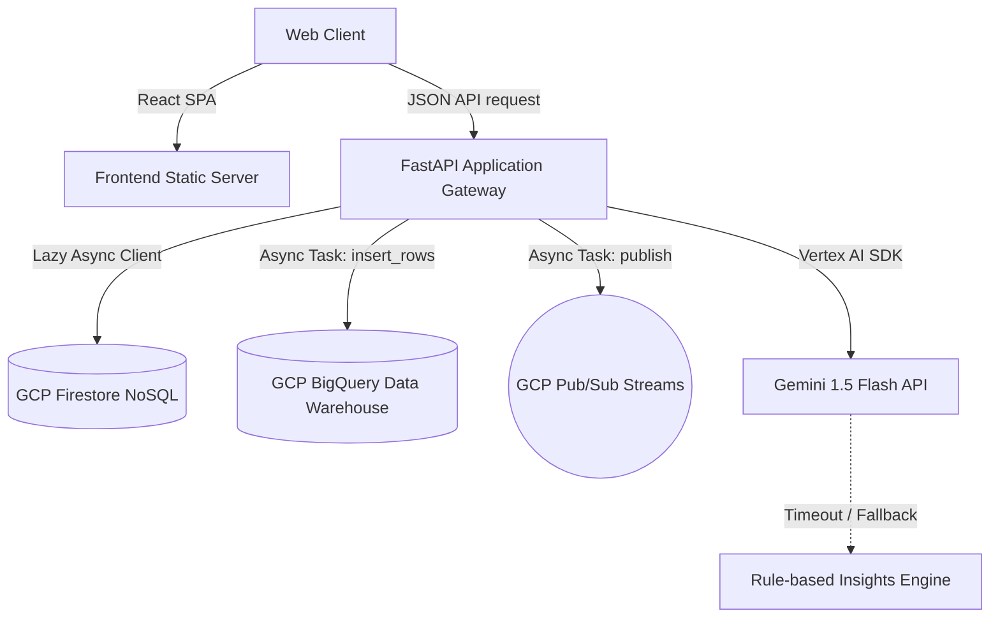

# System Architecture & Service Topologies

This document details the architectural layout and service topologies of the platform.

---

## 1. Top-level Component Design
The system is divided into two primary execution boundaries hosted within a single multi-stage Docker environment:



---

## 2. Decoupled Processing Pipeline
When a user submits calculation inputs:
1. **Calculation**: FastAPI performs the calculations synchronously using coefficients from factors module (sub-1ms execution).
2. **AI Enrichment**: The handler contacts Vertex AI for custom tips. If the API times out (8s limit) or fails, the handler falls back to local rules.
3. **Async Dispatch**: The API queues writes to BigQuery and Pub/Sub in the background:
   ```python
   asyncio.create_task(log_calculation_event(...))
   asyncio.create_task(publish_calculation_event(...))
   ```
4. **Immediate Response**: The HTTP request returns the calculated data to the user without blocking on slow database operations.

---

## 3. Data Topologies & Schema Integrity
* **Firestore**: Stores documents indexed under `carbon_entries` Collection. Queries are strictly scoped to the `device_id` field.
* **BigQuery**: Streaming pipeline inserts analytical data into table `carbonfootprint-sakshi:carbon_analytics.carbon_events` for offline warehouse analysis.
* **Pub/Sub**: Events are broadcasted to the `carbon-insights` topic for downstream consumer services.
